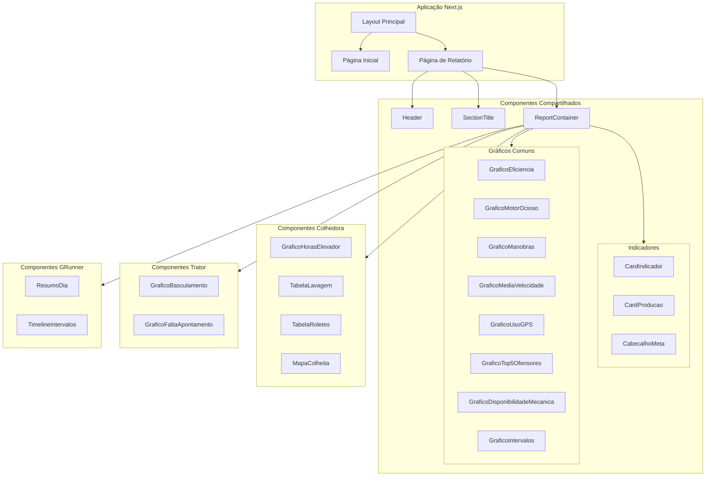
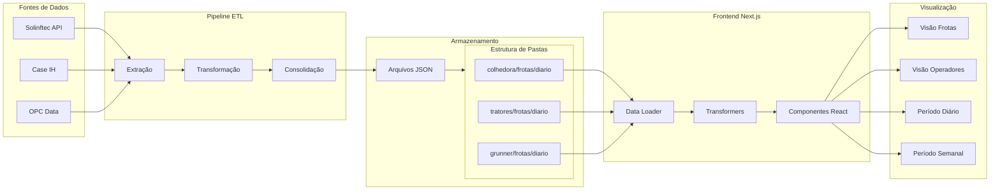
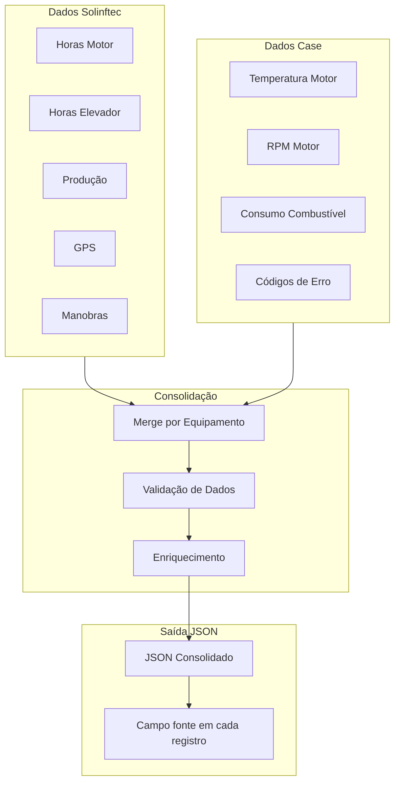
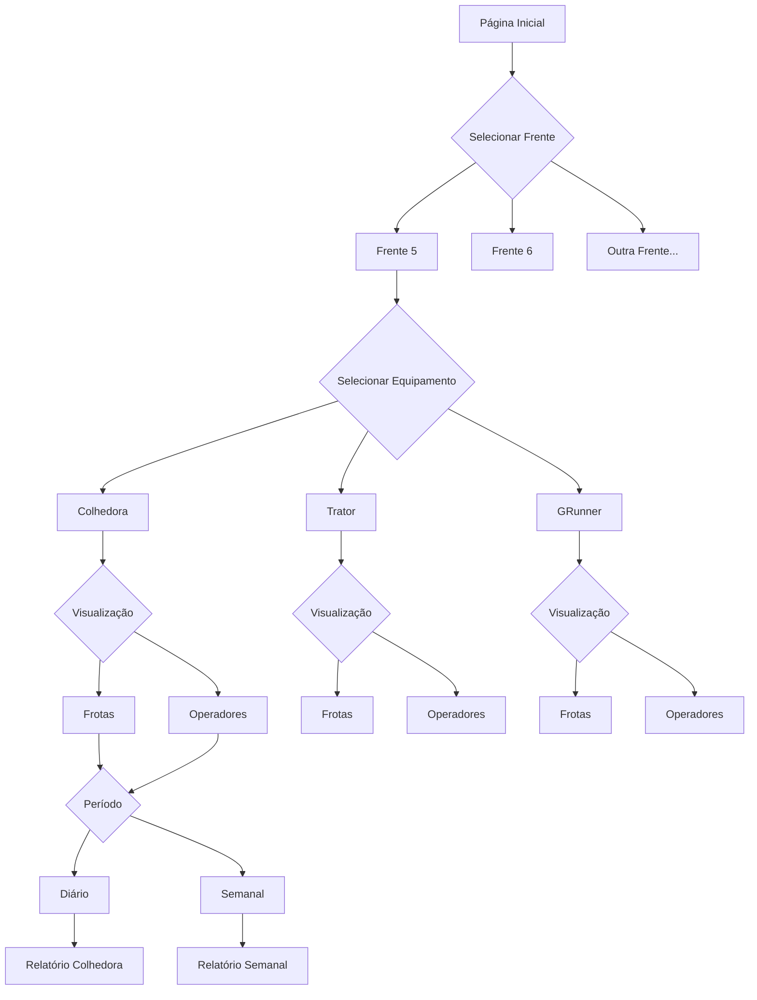

# Planejamento de Arquitetura Frontend - Gerador de Relatórios

## 1. Visão Geral

Este documento descreve a nova arquitetura frontend para o gerador de relatórios, organizada por **fonte de dados** (Solinftec primeiro, depois Case) e **tipo de equipamento** (Colhedora, Trator).

---

## 2. Estrutura de Pastas Proposta

```
gerador_relatorios/frontend/
├── app/
│   ├── layout.tsx
│   ├── page.tsx                          # Página inicial com seleção de relatório
│   ├── globals.css
│   │
│   └── relatorio/
│       └── [frente]/
│           └── [equipamento]/
│               └── [visualizacao]/
│                   └── [periodo]/
│                       └── page.tsx      # Página dinâmica de relatório
│
├── components/
│   ├── ui/                               # Componentes shadcn/ui
│   │   ├── button.tsx
│   │   ├── card.tsx
│   │   ├── input.tsx
│   │   └── ...
│   │
│   ├── shared/                           # Componentes compartilhados
│   │   ├── layout/
│   │   │   ├── Header.tsx                # Cabeçalho com logo e título
│   │   │   ├── SectionTitle.tsx          # Títulos de seção
│   │   │   └── ReportContainer.tsx       # Container padrão de relatório
│   │   │
│   │   ├── indicadores/
│   │   │   ├── CardIndicador.tsx         # Card de indicador KPI
│   │   │   ├── CardProducao.tsx          # Card de produção
│   │   │   ├── CabecalhoMeta.tsx         # Cabeçalho com meta
│   │   │   └── CabecalhoProducao.tsx     # Cabeçalho de produção
│   │   │
│   │   ├── graficos/
│   │   │   ├── GraficoEficiencia.tsx     # Gráfico de eficiência (unificado)
│   │   │   ├── GraficoMotorOcioso.tsx    # Gráfico motor ocioso
│   │   │   ├── GraficoManobras.tsx       # Gráfico de manobras
│   │   │   ├── GraficoMediaVelocidade.tsx
│   │   │   ├── GraficoUsoGPS.tsx
│   │   │   ├── GraficoTop5Ofensores.tsx
│   │   │   ├── GraficoDisponibilidadeMecanica.tsx
│   │   │   ├── GraficoIntervalos.tsx     # Timeline de intervalos
│   │   │   └── GraficoToneladasPorFrota.tsx
│   │   │
│   │   ├── tabelas/
│   │   │   └── TabelaResumo.tsx          # Tabela resumo
│   │   │
│   │   └── utilitarios/
│   │       ├── cores.ts                  # Funções de cor por meta
│   │       └── formatters.ts             # Formatadores de data/hora
│   │
│   ├── colhedora/                        # Componentes específicos de Colhedora
│   │   ├── GraficoHorasElevador.tsx      # Específico: horas do elevador
│   │   ├── TabelaLavagem.tsx             # Específico: lavagem
│   │   ├── TabelaRoletes.tsx             # Específico: roletes
│   │   └── MapaColheita.tsx              # Mapa de colheita
│   │
│   ├── trator/                           # Componentes específicos de Trator
│   │   ├── GraficoBasculamento.tsx       # Específico: basculamento
│   │   └── GraficoFaltaApontamento.tsx   # Específico: falta de apontamento
│   │
│   └── grunner/                          # Componentes específicos de GRunner
│       ├── ResumoDia.tsx                 # Resumo do dia GRunner
│       └── TimelineIntervalos.tsx        # Timeline de intervalos
│
├── lib/
│   ├── data/
│   │   ├── loader.ts                     # Carregador de dados JSON
│   │   ├── types.ts                      # Tipos TypeScript
│   │   └── transformers.ts               # Transformadores de dados
│   │
│   └── utils/
│       ├── pdf-utils.ts                  # Utilitários de PDF
│       └── date-utils.ts                 # Utilitários de data
│
├── config/
│   ├── metas.json                        # Metas por tipo de equipamento
│   └── routes.ts                         # Configuração de rotas
│
└── public/
    └── logo.png
```

---

## 3. Diagrama de Hierarquia de Componentes



---

## 4. Diagrama de Fluxo de Dados



---

## 5. Estratégia de Reutilização de Componentes

### 5.1 Componentes Compartilhados (Shared)

| Componente | Colhedora | Trator | GRunner | Observações |
|------------|-----------|--------|---------|-------------|
| `GraficoEficiencia` | ✅ | ✅ | ✅ | Unificado com props diferentes |
| `GraficoMotorOcioso` | ✅ | ✅ | ✅ | Mesma lógica |
| `GraficoManobras` | ✅ | ✅ | ✅ | Mesma lógica |
| `GraficoMediaVelocidade` | ✅ | ✅ | ✅ | Mesma lógica |
| `GraficoUsoGPS` | ✅ | ✅ | ❌ | Não aplicável a GRunner |
| `GraficoTop5Ofensores` | ✅ | ✅ | ❌ | Não aplicável a GRunner |
| `GraficoDisponibilidadeMecanica` | ✅ | ✅ | ✅ | Mesma lógica |
| `GraficoIntervalos` | ✅ | ✅ | ✅ | Timeline de operação |
| `CardIndicador` | ✅ | ✅ | ✅ | Card KPI genérico |
| `CardProducao` | ✅ | ✅ | ✅ | Card de produção |
| `TabelaResumo` | ✅ | ✅ | ✅ | Tabela resumo |

### 5.2 Componentes Específicos por Equipamento

#### Colhedora (Solinftec + OPC)
- `GraficoHorasElevador` - Horas de operação do elevador
- `TabelaLavagem` - Controle de lavagem
- `TabelaRoletes` - Controle de roletes
- `MapaColheita` - Mapa geográfico de colheita

#### Trator (Case)
- `GraficoBasculamento` - Dados de basculamento
- `GraficoFaltaApontamento` - Análise de faltas de apontamento

#### GRunner (Solinftec)
- `ResumoDia` - Resumo diário específico
- `TimelineIntervalos` - Timeline detalhada de intervalos

---

## 6. Integração de Dados por Fonte

### 6.1 Estrutura de Dados JSON

```typescript
// Tipos TypeScript para os dados
interface Metadata {
  date: string;
  type: 'cd_diario_novo' | 'tt_diario_novo' | 'gr_diario';
  frente: string;
  generated_at: string;
  fontes: ('solinftec' | 'opc' | 'case')[];
}

interface Metas {
  eficienciaEnergetica: number;
  eficienciaOperacional: number;
  horaElevador: number;
  usoGPS: number;
  mediaVelocidade: number;
  manobras: number;
  producao: number;
  disponibilidadeMecanica: number;
  motorOcioso: number;
}

interface DadosRelatorio {
  metadata: Metadata;
  metas: Metas;
  eficiencia_energetica: ItemEficiencia[];
  eficiencia_operacional: ItemEficiencia[];
  horas_elevador: ItemHorasElevador[];
  uso_gps: ItemUsoGPS[];
  media_velocidade: ItemVelocidade[];
  manobras_frotas: ItemManobra[];
  motor_ocioso: ItemMotorOcioso[];
  producao_por_frota: ItemProducao[];
  disponibilidade_mecanica: ItemDisponibilidade[];
  intervalos_operacao: Intervalo[];
  ofensores: Ofensor[];
  // Específicos por equipamento
  basculamento_frotas?: ItemBasculamento[];  // Trator
  falta_apontamento?: ItemFaltaApontamento[]; // Trator
  lavagem?: ItemLavagem[];                    // Colhedora
  roletes?: ItemRoletes[];                    // Colhedora
}
```

### 6.2 Carregador de Dados

```typescript
// lib/data/loader.ts
export async function carregarDadosRelatorio(
  equipamento: 'colhedora' | 'tratores' | 'grunner',
  visualizacao: 'frotas' | 'operadores',
  periodo: 'diario' | 'semanal',
  data: string
): Promise<DadosRelatorio> {
  const basePath = '/automacao_etl/dados/separados/json';
  const filePath = `${basePath}/${equipamento}/${visualizacao}/${periodo}/${equipamento}_${visualizacao}_${data}.json`;
  
  const response = await fetch(filePath);
  if (!response.ok) {
    throw new Error(`Dados não encontrados: ${filePath}`);
  }
  
  return response.json();
}
```

### 6.3 Integração Solinftec + Case



---

## 7. Estrutura de Navegação e Rotas

### 7.1 Rotas Next.js App Router

```
/                                    # Página inicial - seleção de frente
/relatorio/[frente]                  # Seleção de equipamento
/relatorio/[frente]/[equipamento]    # Seleção de visualização
/relatorio/[frente]/[equipamento]/[visualizacao]  # Seleção de período
/relatorio/[frente]/[equipamento]/[visualizacao]/[periodo]  # Relatório
```

### 7.2 Exemplos de URLs

| URL | Descrição |
|-----|-----------|
| `/` | Página inicial |
| `/relatorio/frente5` | Equipamentos da Frente 5 |
| `/relatorio/frente5/colhedora` | Visualizações de Colhedora |
| `/relatorio/frente5/colhedora/frotas` | Períodos de Frotas |
| `/relatorio/frente5/colhedora/frotas/diario` | Relatório diário |
| `/relatorio/frente5/trator/frotas/diario` | Relatório diário de tratores |

### 7.3 Diagrama de Navegação



---

## 8. Componente GraficoEficiencia Unificado

### 8.1 Interface Unificada

```typescript
// components/shared/graficos/GraficoEficiencia.tsx

interface ItemEficienciaBase {
  id: string | number;
  nome: string;
  eficiencia: number;
  horasMotor: number;
}

// Colhedora usa horasElevador
interface ItemEficienciaColhedora extends ItemEficienciaBase {
  horasElevador: number;
  tipo?: 'colhedora';
}

// Trator usa horasProdutivas
interface ItemEficienciaTrator extends ItemEficienciaBase {
  horasProdutivas: number;
  tipo?: 'trator';
}

// GRunner usa horasProdutivas
interface ItemEficienciaGRunner extends ItemEficienciaBase {
  horasProdutivas: number;
  tipo?: 'grunner';
}

type ItemEficiencia = ItemEficienciaColhedora | ItemEficienciaTrator | ItemEficienciaGRunner;

interface GraficoEficienciaProps {
  dados: ItemEficiencia[];
  meta: number;
  compact?: boolean;
  listrado?: boolean;
  maxRows?: number;
  density?: 'auto' | 'normal' | 'tight';
  tipoEquipamento: 'colhedora' | 'trator' | 'grunner';
}
```

### 6.2 Lógica de Renderização

```typescript
export function GraficoEficiencia({ 
  dados, 
  meta, 
  tipoEquipamento,
  ...props 
}: GraficoEficienciaProps) {
  // Determina qual campo de horas mostrar baseado no tipo
  const getHorasSecundarias = (item: ItemEficiencia) => {
    switch (tipoEquipamento) {
      case 'colhedora':
        return (item as ItemEficienciaColhedora).horasElevador;
      case 'trator':
      case 'grunner':
        return (item as ItemEficienciaTrator).horasProdutivas;
    }
  };

  const getLabelSecundario = () => {
    switch (tipoEquipamento) {
      case 'colhedora':
        return 'Horas Elevador';
      case 'trator':
      case 'grunner':
        return 'Horas Produtivas';
    }
  };

  // Renderização...
}
```

---

## 9. Fases de Implementação

### Fase 1: Infraestrutura Base
- [ ] Criar estrutura de pastas
- [ ] Configurar tipos TypeScript
- [ ] Implementar carregador de dados
- [ ] Criar componentes de layout compartilhados

### Fase 2: Componentes Compartilhados
- [ ] Mover e unificar `GraficoEficiencia`
- [ ] Mover e unificar `GraficoMotorOcioso`
- [ ] Mover e unificar `GraficoManobras`
- [ ] Mover e unificar `GraficoMediaVelocidade`
- [ ] Mover e unificar `GraficoUsoGPS`
- [ ] Mover e unificar `GraficoTop5Ofensores`
- [ ] Mover e unificar `GraficoDisponibilidadeMecanica`
- [ ] Mover e unificar `GraficoIntervalos`
- [ ] Mover componentes de indicadores

### Fase 3: Componentes Específicos
- [ ] Mover componentes de Colhedora
- [ ] Mover componentes de Trator
- [ ] Criar componentes de GRunner

### Fase 4: Páginas de Relatório
- [ ] Implementar roteamento dinâmico
- [ ] Criar página de relatório de Colhedora Frotas Diário
- [ ] Criar página de relatório de Colhedora Frotas Semanal
- [ ] Criar página de relatório de Colhedora Operadores Diário
- [ ] Criar página de relatório de Colhedora Operadores Semanal
- [ ] Criar página de relatório de Trator Frotas Diário
- [ ] Criar página de relatório de Trator Frotas Semanal
- [ ] Criar página de relatório de Trator Operadores Diário
- [ ] Criar página de relatório de Trator Operadores Semanal
- [ ] Criar página de relatório de GRunner Frotas Diário
- [ ] Criar página de relatório de GRunner Operadores Diário

### Fase 5: Navegação e UX
- [ ] Implementar página inicial
- [ ] Criar navegação por breadcrumbs
- [ ] Implementar seleção de data
- [ ] Adicionar funcionalidade de PDF

### Fase 6: Testes e Refinamentos
- [ ] Testar carregamento de dados
- [ ] Validar visualizações
- [ ] Otimizar performance
- [ ] Documentar componentes

---

## 10. Considerações Técnicas

### 10.1 Dependências Atuais
- Next.js 14+ (App Router)
- React 18+
- TypeScript
- Tailwind CSS
- shadcn/ui components
- Recharts (para gráficos)
- Leaflet (para mapas)

### 10.2 Performance
- Carregamento dinâmico de dados JSON
- Lazy loading de componentes pesados (MapaColheita)
- Cache de dados em memória
- Otimização de re-renders com React.memo

### 10.3 Acessibilidade
- Labels adequados para gráficos
- Contraste de cores conforme WCAG
- Navegação por teclado
- Suporte a leitores de tela

---

## 11. Próximos Passos

1. **Validar arquitetura** com a equipe
2. **Criar branch** para implementação
3. **Iniciar Fase 1** da implementação
4. **Documentar decisões** durante o desenvolvimento

---

## 12. Referências

- [Next.js App Router](https://nextjs.org/docs/app)
- [shadcn/ui](https://ui.shadcn.com/)
- [Recharts](https://recharts.org/)
- [Leaflet](https://leafletjs.com/)
