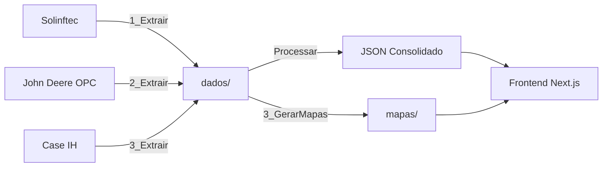

# Planejamento do Projeto - Brunozzi Automação ETL

## Visão Geral

Sistema de automação para extração, processamento e visualização de dados operacionais agrícolas, integrando múltiplas fontes (Solinftec, John Deere OPC, Case IH) em um dashboard unificado.

---

## Arquitetura

```
brunozzi/
├── automacao_etl/           # Scripts de extração e processamento
│   ├── scripts/             # Scripts Python principais
│   ├── utils/               # Configurações e utilitários
│   ├── dados/               # Dados brutos extraídos
│   └── mapas/               # Mapas HTML gerados
│
├── gerador_relatorios/      # Frontend Next.js
│   ├── components/          # Componentes React
│   ├── pages/               # Páginas do app
│   └── public/              # Assets estáticos
│
└── docs/                    # Documentação
```

---

## Fluxo de Dados



---

## Fases do Projeto

### Fase 1: Extração (ETL) ✅ Em Progresso

| Script                           | Status | Descrição                                                   |
| -------------------------------- | ------ | ----------------------------------------------------------- |
| `1_ExtrairRelatorioSolinftec.py` | ✅     | Extrai relatórios da plataforma Solinftec via Selenium      |
| `2_ExtrairTrabalho_OPC.py`       | ✅     | Extrai dados do John Deere Operations Center via Playwright |
| `3_ExtrairCase.py`               | ⏳     | A criar: Extração de dados Case IH                          |

### Fase 2: Processamento ✅ Em Progresso

| Script                  | Status | Descrição                                   |
| ----------------------- | ------ | ------------------------------------------- |
| `4_GerarMapasFrotas.py` | ✅     | Gera mapas Leaflet com trajetos das frotas  |
| Processador JSON Base   | ⏳     | A criar: Consolida dados de todas as fontes |

### Fase 3: Frontend ⏳ Pendente

- Página principal com cards por tipo de equipamento
- Listagem de relatórios por dia
- Mapas interativos embeddados
- Gráficos de indicadores

### Fase 4: Indicadores ⏳ Pendente

- Revisar fórmulas de cálculo
- Validar dados entre fontes

### Fase 5: Finalização ⏳ Pendente

- Automação via Task Scheduler
- Documentação

---

## Configuração de Datas

A lógica de prioridade implementada em todos os scripts:

1. **Semanal** (`extrair_semanal: true`) → Últimos 7 dias terminando ontem
2. **Ontem** (`extrair_ontem: true`) → Apenas data de ontem
3. **Manual** (`data_inicial` / `data_final`) → Intervalo específico
4. **Fallback** → Ontem (se tudo vazio)

---

## Próximos Passos

1. Finalizar lógica de datas (verificação) ✅
2. Criar script de extração Case IH
3. Criar processador JSON consolidado
4. Iniciar frontend Next.js
